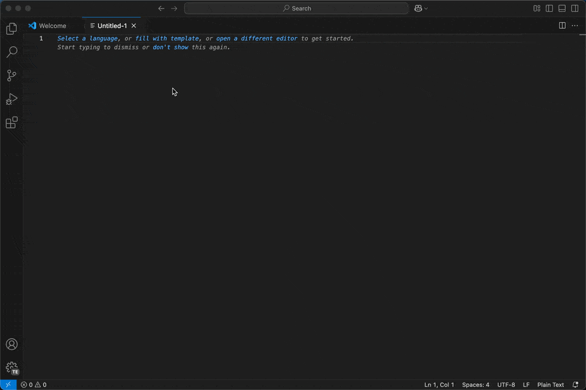

# secret-toolkit-vscode

[](https://opensource.org/licenses/MIT)

This is a toolkit for working with secrets like passwords, passphrases or encryption-keys in vscode.

## Features

- Generate secure passwords and passphrases with customizable presets.
  - custom charactersets
  - avoid ambiguous characters
  - base64 encoding
  - hex value generation
- Calculate and display the entropy of passwords to evaluate their strength.


## How to use

To access the commands provided by secret-toolkit press `Ctrl+Shift+P` (or `Cmd+Shift+P` on Mac) at any time and start typing `secret-toolkit`. The options shoudld appear and can now be selected.




## Extension Settings

The extension can be customized using the following settings:

### Presets

`secret-toolkit-vscode.presets`: A list of presets for generating passwords and passphrases. Each preset can have the following properties:

#### Default properties for all modes/types

- `id`: Unique identifier for the preset.
- `description`: Description of the preset. (optional)
- `type`: Type of the generated secret (password, passphrase, hex)

#### Properties for `password`-type

- `length`: Minimum length of the generated password.
  - Optional value, if not specified or 0 the user is prompted every time
- `defaultLength`: Default length if the user is prompted for input.
  - If length is not specified or its 0, the user is prompted for lenght. The default of 16 can be overridden here.

The following options describe what characters should be used. If a character set is not specified or 0 it will not be used.
All of them are optional though at least one hase to be specified. The combined minimum numbers cannot exceed the password length.

- `lowercase`: Minimum number of lowercase characters.
- `uppercase`: Minimum number of uppercase characters.
- `numbers`: Minimum number of numeric characters.
- `specialReduced`: Minimum number of reduced special characters.
- `specialAll`: Minimum number of all special characters.
- `custom`: Minimum number of custom characters.
- `customCharacters`: Custom characters to include in the password.
- `avoidAmbiguous`: Avoid ambiguous characters. (`true` | `false`)
- `encode`: Encoding method for the password
  - Supported encodings are `base64` or any hashing algorighm supported by `crypto`-library (e.g. `md5`, `sha256`)

#### Properties for `hex`-type

- `bytes`: Byte count used for hex generation.
- `defaultBytes`: Default bytes if the user is prompted for input.

All conditions of `password-length*`-parameters apply to bytes as well.

##### Example presets:

```json
{
    "id": "ESPhome API Encryption Key",
    "description": "32 character base64 encoded encryption key",
    "type": "password",
    "length": 32,
    "lowercase": 1,
    "uppercase": 1,
    "numbers": 1,
    "customCharacters": "",
    "avoidAmbiguous": true,
    "encode": "base64"
},
{
    "id": "ESPhome OTA Password",
    "description": "32byte hex value",
    "type": "hex",
    "bytes": 32
}
```

---

## For more information
* [GitHub Repo](https://github.com/hbrennhaeuser/secret-toolkit-vscode)